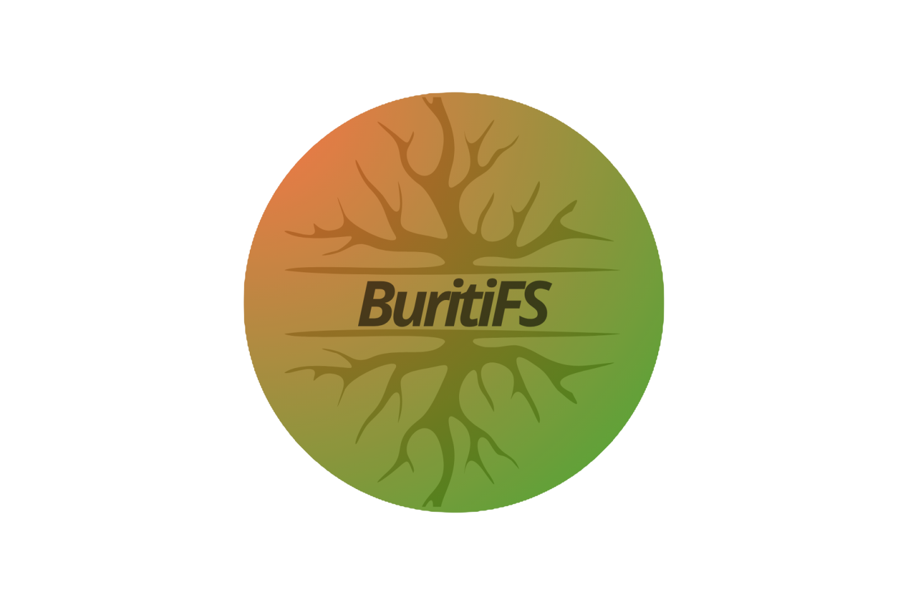

# BuritiFS

<div align="center">
  
</div>

<div align="center">

[](https://www.npmjs.com/package/buritifs)
[](https://www.typescriptlang.org/)
[](LICENSE)

**A real filesystem API for the browser — paths, copy/move/rename, and crash recovery, all in one library.**

</div>

---

## What is BuritiFS?

BuritiFS is a TypeScript library that gives you a real filesystem abstraction inside the browser. It combines two browser storage primitives — **OPFS** (Origin Private File System) for binary file content and **IndexedDB** for the node tree, metadata, and structure — and exposes a single, unified API driven by familiar path strings.

Without BuritiFS, building a browser-based file manager means manually juggling IndexedDB transactions, OPFS handles, recursive copy/move logic, and cross-storage consistency. If the user closes the tab mid-write, data becomes inconsistent with no recovery path.

BuritiFS solves all of this:

- **Path-based API** — work with `/projects/app/index.ts` just like in Node.js.
- **Recursive operations** — `copy`, `move`, and `delete` handle entire folder trees atomically.
- **Dual-storage consistency** — a Write-Ahead Log (WAL) keeps OPFS content and IndexedDB metadata in sync.
- **Automatic crash recovery** — on every initialization, three recovery phases clean up any state left by interrupted operations.
- **Reactive subscriptions** — `subscribe(path, fn)` fires whenever anything under that path changes, bubbling up to the root automatically.

> The name *Buriti* comes from a Brazilian palm tree. FS stands for File System.

---

## Why BuritiFS?

| Feature | Raw OPFS + IDB | BuritiFS |
|---|---|---|
| Path-based addressing | No | Yes (`/folder/file.txt`) |
| Recursive copy/move | Manual | Built-in |
| Cross-storage consistency | Manual transactions | WAL + auto-recovery |
| Crash recovery | None | 3-phase recovery on init |
| React integration | None | `useExplorer`, `useFolder`, `useAction` |
| Vue/Svelte/Vanilla reactivity | Manual | `subscribe(path, fn)` |
| TypeScript-first | Partial | Full, with discriminated union results |

### API that never throws

Every public method returns `{ ok: true, error: null, ...data }` on success or `{ ok: false, error: string }` on failure. No try/catch required. TypeScript narrows the type automatically based on `result.ok`.

### Reactive by default

`subscribe(path, fn)` propagates changes upward through the directory tree. Subscribing to `/` means you get notified of every change in the filesystem. Subscribing to `/projects` means you get notified of changes anywhere inside `projects/`. The React hooks use this internally — `useFolder` re-renders automatically when the folder contents change.

### Designed for offline-first

Because BuritiFS uses OPFS and IndexedDB — both persistent browser storages — the data survives page refreshes, tab closures, and offline sessions without any server.

---

## Is it for you?

BuritiFS is a good fit for:

- **Browser-based code editors** — store source files in OPFS, navigate them with path APIs, and react to changes in real time.
- **Web IDEs** — maintain a project tree with folders, files, and metadata entirely in the browser.
- **Offline-first apps** — ship a fully functional file system that works without a network connection.
- **Design tools** — store assets, project files, and drafts with version-like copy semantics.
- **Games with save systems** — treat save slots as files in a folder, move/copy between them with one call.
- **Document editors** — handle attachments, exports, and auto-saves with a consistent API.

---

## Try it Live

An interactive example is available at **[samuelhenriquedemoraisvitrio.github.io/BuritiFS](https://samuelhenriquedemoraisvitrio.github.io/BuritiFS/)** — a browser-based code editor backed entirely by BuritiFS, with a file explorer, tab management, and persistent storage. No server required.

---

## Quick Demo

### Vanilla TypeScript (no framework)

```typescript
import { ExplorerTree } from 'buritifs';

const tree = await ExplorerTree.create({ name: 'my-app' });

if (!(tree instanceof ExplorerTree)) {
  console.error('Failed to open filesystem:', tree.error);
  return;
}

// Get the root ExplorerFolder at "/"
const rootResult = await tree.source({ path: '/' });
if (!rootResult.ok) throw new Error(rootResult.error);
const root = rootResult;

const docs = await root.newFolder({ name: 'docs' });
if (!docs.ok) throw new Error(docs.error);

const file = await docs.newFile({ name: 'readme.txt' });
if (!file.ok) throw new Error(file.error);

await file.write({ content: 'Hello, BuritiFS!' });

const read = await file.read();
if (read.ok) {
  console.log(read.text); // "Hello, BuritiFS!"
}

const unsubscribe = root.tree.subscribe('/', () => {
  console.log('Something changed in the filesystem');
});

unsubscribe();
ExplorerTree.close({ name: 'my-app' });
```

### React

```tsx
import { useExplorer, useFolder, useAction } from 'buritifs/react';

function App() {
  const explorer = useExplorer('my-app');

  if (explorer.status === 'loading') return <p>Opening filesystem...</p>;
  if (explorer.status === 'error') return <p>Error: {explorer.error}</p>;

  return <FileTree root={explorer.root} />;
}

function FileTree({ root }) {
  const { items, loading } = useFolder(root);

  const createFile = useAction(() =>
    root.newFile({ name: `file-${Date.now()}.txt` })
  );

  if (loading) return <p>Loading...</p>;

  return (
    <div>
      <button onClick={createFile.run} disabled={createFile.loading}>
        New File
      </button>
      {createFile.error && <p style={{ color: 'red' }}>{createFile.error}</p>}
      <ul>
        {items.map(item => (
          <li key={item.path}>{item.path} ({item.type})</li>
        ))}
      </ul>
    </div>
  );
}
```

---

## Browser Support

| Browser | IndexedDB | OPFS | Status |
|---|---|---|---|
| Chrome 86+ | Yes | Yes | Fully supported |
| Edge 86+ | Yes | Yes | Fully supported |
| Safari 15.2+ | Yes | Yes | Fully supported |
| Firefox | Yes | Limited* | Partial support |

> **Firefox note:** Firefox supports OPFS but lacks the synchronous access handle (`createSyncAccessHandle`) and has limited support for the asynchronous API in certain contexts. Core metadata operations via IndexedDB work fine, but file content read/write may not function in all Firefox versions.

---

## Installation

```bash
npm install buritifs
```

```bash
pnpm add buritifs
```

```bash
yarn add buritifs
```

React hooks are in a separate subpath to keep the core tree-shakeable:

```typescript
// Core (vanilla, Vue, Svelte, Angular...)
import { ExplorerTree, ExplorerFolder, ExplorerFile } from 'buritifs';

// React hooks
import { useExplorer, useFolder, useAction } from 'buritifs/react';
```

---

## Roadmap

- [x] ExplorerTree with path-based API
- [x] Recursive copy, move, delete
- [x] WAL-based consistency between OPFS and IndexedDB
- [x] 3-phase crash recovery on initialization
- [x] Reactive subscribe system (bubbles to root)
- [x] React hooks: useExplorer, useFolder, useAction
- [x] Interactive browser example (code editor on GitHub Pages)
- [x] CI/CD with semantic-release (automated versioning and npm publish)
- [ ] `useFile` — reactive hook for file content, auto-updating when the file is written
- [ ] Synchronous OPFS access via Web Worker for high-performance I/O
- [ ] GitHub sync — push/pull filesystem snapshots to a GitHub repository
- [ ] Vue 3 composables (`useExplorer`, `useFolder`)
- [ ] Svelte 5 runes integration

---

## Getting Started

See **[docs/getting-started.md](docs/getting-started.md)** for a step-by-step guide.

- [Core API overview](docs/core/overview.md)
- [React hooks guide](docs/react/overview.md)
- [Using without React](docs/guides/without-react.md)
- [Browser support details](docs/guides/browser-support.md)
